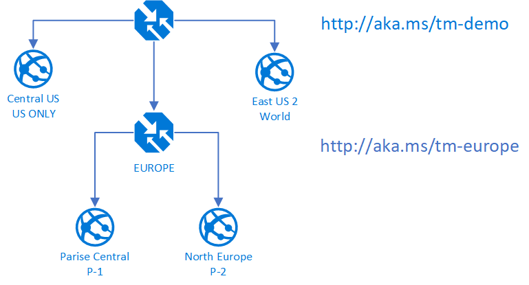
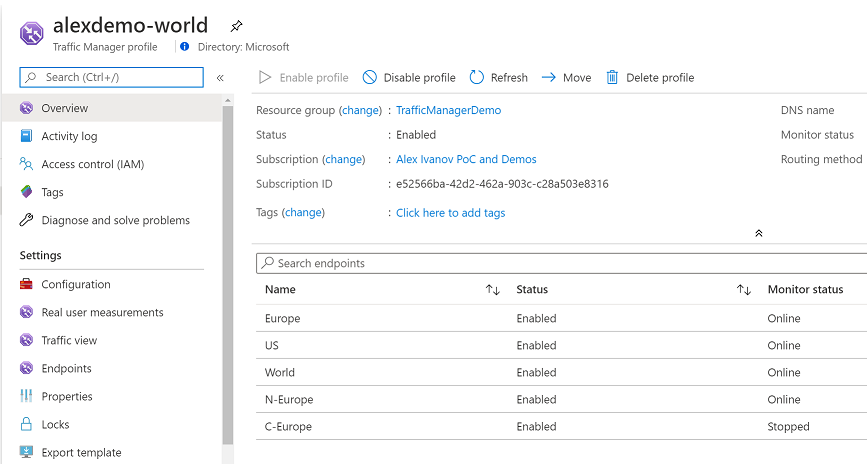
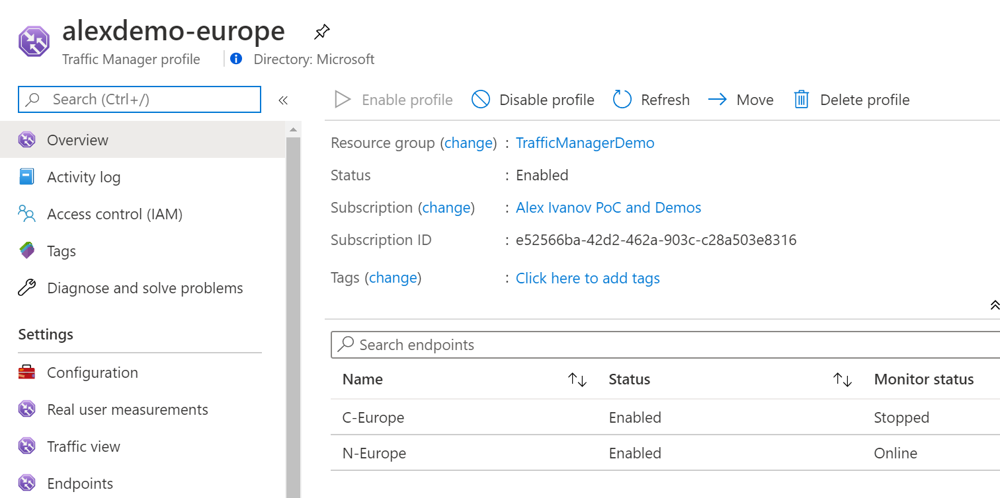

# AZ-203T02A-02 Demo: Network Integration

In this demo you will observer behavior of the Traffic Manager. You will deploy 4 Web apps and manage the access based on the client location. 

## Before delivery:

1. Create 4 Web App (2 US and 2 Europe) in different region. I select Central US, East US 2, Central France, West Europe. Each of the Web site has own page for test access. 
1. Web Site must be provisioned with S1 sku!
- Deploy code from the folders to the appropriate web site.
- Deploy two traffic managers in US and Europe
- Configuration of US traffic Manager

- Configuration of EU traffic Manager

## In class:

1. Follow the link http://aka.ms/tm-demo or the link of your US Traffic Manager. Depend on your location US will go to Central US. Europe will go to Paris, rest of the world will go to East US2 

1. Create custom rule for your location to East US2 - refresh page or open another browser. You should see web site from that location.

2. Follow the link http://aka.ms/tm-demo or the link of your EU Traffic Manager. Your web site with highest priority should appears. 

3. You can stop the site to demonstrate disaster. Now when you refresh page anther site by priority should respond.

> You can find deployment template in the **template** folder and AZ script to scale up and down your Web sites.