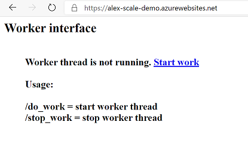

# AZ-204 Demo: Autoscale Azure Web App by using performance metrics

In the demo you will build Python app to generate CPU load. 
Then you will set up CPU autoscale rules and monitor scaling in and out.

## Preparation steps:

- Provision Azure Web App on Linux platform by using Standard price tier.
- Deploy demo code located on [pyWebApp](pyWebApp) folder by use VS Code "Web Application: Deploy..." command.
- Setup autoscale rules CPU > 50% +1 and CPU < 10% -1. For simplicity and speedup demo chose the shortest intervals

## Demonstration:

- Visit web site page and click "start work" to start generation CPU activity

- When you start and stop generation you might get following graph of scalding per instance based on CPU load

