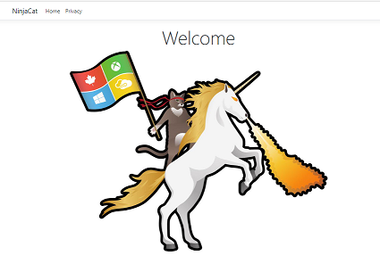

# AZ-204 Demo: Deployment Web App

In the demo you will create new Web App and deploy web app from Zip Archive. Then you will set up continues integration from GitHub Repository.

## Before delivery:

- Install VSCode and Azure CLI Tools.
- Run the script **webapp.azcli** and make sure that archive works for you.
- You should run script from the same folder where is archive.

## In class:

1. Open VSCode and run the script **webapp.azcli** line by line
2. Check the result on the web app – should be a test page.

3. In case of PS, PowerShell script `WebApp.ps1` located in the same folder.

4. If time permits set up [CD deployment from github](https://docs.microsoft.com/en-us/azure/app-service/deploy-continuous-deployment)

> Note: you can use following git repo for your demo **https://github.com/true-while/secure-web-https.git**

PowerShell deployment  tutorial could be find [here](https://docs.microsoft.com/en-us/azure/app-service/scripts/powershell-deploy-staging-environment)