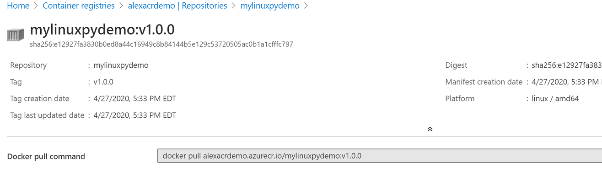
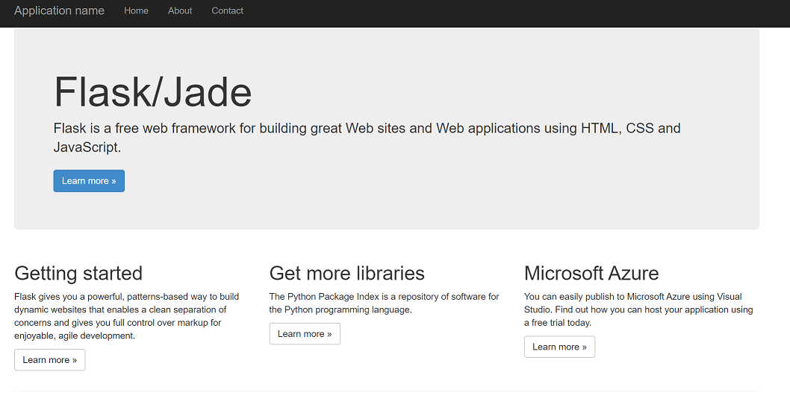

# AZ-204 Demo: Creating Linux Web App from container

In the demo you will create new Python Web App create a container image and deploy on Azure Web App platform. 
Also from the demo script you will build and deploy Docker Image to Azure Container Registry.

## Before delivery:

- Install [Docker](https://docs.docker.com/get-docker/) 
- Install VSCode and Azure CLI Tools.
- Run the script **webapp.azcli** and make sure that archive works for you.
- You should run script from the same folder where is archive.

## In class:

1. Docker Desktop should be started.
1. Open VSCode and run the script **webapp.azcli** line by line. You can sckeep step to run container locally to speed up demo.

1. You can check your ACR. The image should be published as `mylinuxpydemo:v1.0.0`

2. Finalize deployment by `az webapp config container set` command and check the result on the web app – should be a test page.

