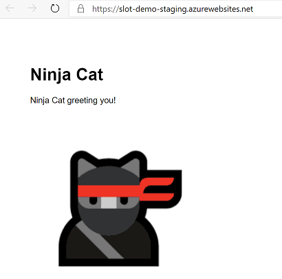

# AZ-204 Demo: Web App Slots and Canary deployment

In the demo you will create and deploy NodeJS web App. Then create a slot and deploy another version of the Web App. Then you can do swap or set up Canary Deployment.

## Before delivery:

- Install VSCode and Azure CLI Tools.
- Provision new LINUX (NodeJS) Web App with S1 SKU.
- Deploy WebApp by use VS Code from folder `\myNodeJsApp\`. 

!(Deploy)[deploy.png]

- Run the script **deploy.azcli** and make sure that archive works for you. 

- Check the slot settings it also should be NodeJs web site.

## In class:

1. Your main web site should be already published:

1. Open VSCode and run the script **deploy.azcli**. Create new slot and do the deployment from zip archive. 

1. Your slot with new version should looks like following:

1. Now you can return to the portal and set up Canary Deployment by provide 5% of traffic to new slot.

1. Now you can swap slots from portal or by use scrip **deploy.azcli**

1. After swapping your MAIN site should looks fixed.

