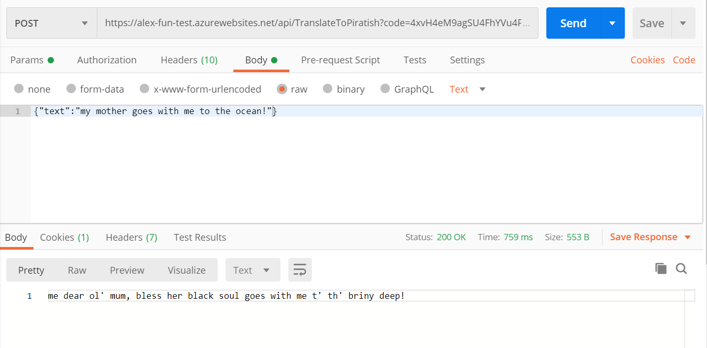

# AZ-204 Demo: C# Azure Functions project

### In the demo you will start Azure Function locally and will reach out the external API with text provided in request. Text will be translated to the Piratish language.


## Before delivery:

1. Obtain storage account connection string and update file `local.settings.json`
1. Open the project _ **TranslateToPirate.sln** _
1. Open project and make sure it is successfully started. Function console appears without errors. 


## In class:

1. Run the project.
1. By using postman navigate to the local address: **http://localhost:7071/api/TranslateToPiratish**

1. Provide following query in request body: 

```json
{"text":"My mother goes with me to the ocean!"}
```
4. Response should looks like: 




> Note the external API is **limited by 5 calls** in hour!