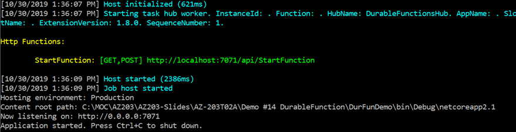
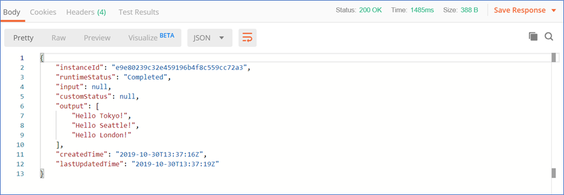

# AZ-203T Demo: Durable Function in C#

### In this demo you will run locally durable function FunIn-FunOut. The function will call the City's function for each of the City.

## Before delivery:

- Open project _ **DurFunDemo.sln** _
- Update _ **local.settings.json** _with your storage account connection string
- Make sure that application started without errors.
- Request the localhost from Postman.

## In class:

1. Run the function

1. Pick the link and request from Postman.
2. Follow the first link in output

1. Repeat call until getting result.

