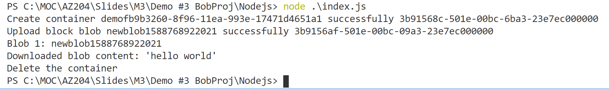

# AZ-204 Demo: Managing Azure Blob from code

In this demo you will build NodeJS project to access files in your Azure Storage blob.

## Before delivery:

- VSCode must be installed
- One Folder with project files
- Run command **npm install**
- Configure file **.env** with conection string to your storage account

```[ini]
connectionString=<your connection string>
```

## In class:

1. One Folder with project files. 
1. Run The project and demonstrate output.
1. The code will create container with random name, upload text file, download the file, delete the container. 

