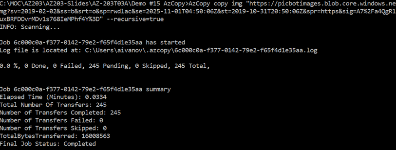
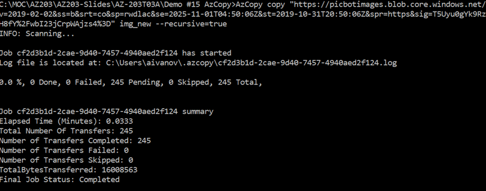

# AZ-204 Demo: Using AzCopy in the Cloud Shell

In the demo you will use AzCopy tool to copy files from local drive to Azure blob storage and download it back.

## Before delivery:

- Care storage account for demo.
- Run _ **AzCopy login** _ to prep your device to access the account.
- Create container `azcopyimg`;
- Obtain SAS keys with write access.
- Update the _ **command.txt** _ with your values.

## In class:

1. You should run command from **command.txt** from the folder where IMG folder. 
1. Open terminal and Run the command your prepare

**AzCopy copy img https://picbotimages.blob.core.windows.net/azcopyimg?.....&quot; --recursive=true**

1. Upload 245 images should be uploaded in few seconds.

1. Run the second command to download images you can create new folder to download your images in.

**AzCopy copy &quot;https://picbotimages.blob.core.windows.net/azcopyimg...&quot; img\_new --recursive=true**

