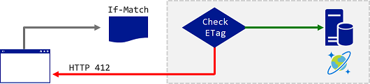
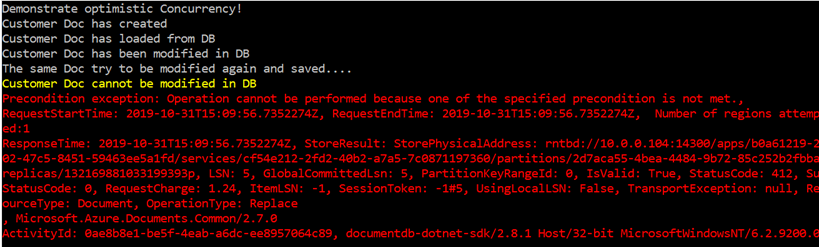

# AZ-204 Demo: Document insertion and Consistency in Cosmos DB by using code

In the demo you will find out how Cosmos DB can be connected from code. You also will setup optimistic concurrency control.

## Before delivery:

- Create Cosmos DB account and provide settings in application content.
- Update **App.Config** with connection info

## In class:

- Open solution _ **DemoConsole.sln** _
- Start project **ControllingConcurrency**
- Demonstrate output and explain the code.

> The **exception** should happen because of the second attempt to change already changed document.