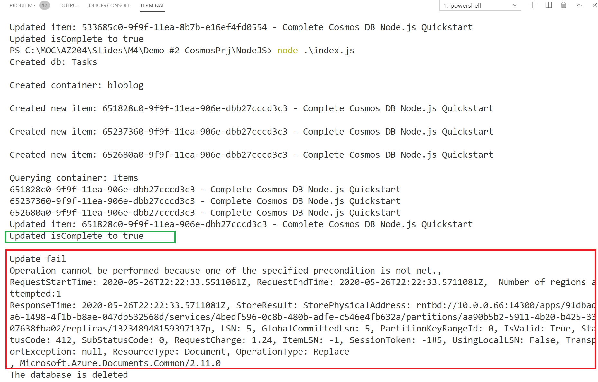

# AZ-204 Demo: Document insertion and Consistency in Cosmos DB by using code

In the demo you will find out how Cosmos DB can be connected from code. You also will setup optimistic concurrency control.


## Before delivery:

- Create Cosmos DB account
- Update **.env** file with your values
- Run application and fix errors.

## In class:

- Open solution folder.
- Execute command **node .\index.js**
- Demonstrate output and explain the error of second update.



> The **exception** should happen because of the second attempt to change already changed document. The `replace` function with accessCondition verify the etag and find out that already changed after previous update. 

```javascript
          .replace(item, { accessCondition: { type: 'IfMatch', condition: item._etag } });

```