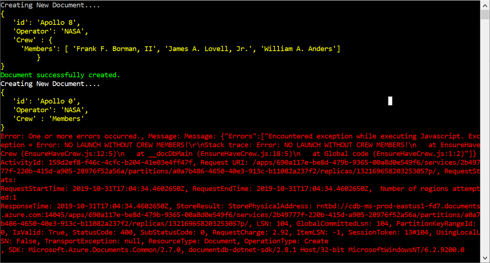

# AZ-204 Demo: Stored proc, Trigger and Transaction support in Cosmos DB

In the demonstration you will find out how to use user define functions, stored procedure and triggers.

## Before delivery:

- Prepare Cosmos DB Collection Apollo for demo. Operator – partition Name
- Import Apollo files If you did not import it yet.
- Create Stored Proc from **sp.js** file – sp calculate all artifacts from Apollo missions for specific partition
- Create UDF from **udf.js** file – udf will find string matching to the regexp patter.
- Create Trigger from trigger.js file. It should be Pre Insert/Update trigger - trigger will reject documents which is not providing exact JSON schema.

## In class:

1. Open Cosmos DB
2. Open SP, UDF and trigger you create previously, demonstrate and explain what they do.
3. Run following query to demonstrate UDF and find the launch pad 39A/B:

```sql
SELECT m.id,m[&quot;Start of mission&quot;][&quot;Launch site&quot;]

FROM Missions m

WHERE udf.Match(m[&quot;Start of mission&quot;][&quot;Launch site&quot;],&quot;39[AB]&quot;)
```

1. Run stored proc to demonstrate result (/Operator – partition name


1. No option to demonstrate trigger from the interface.

You can use **DemoConsole.sln** and run project **TriggerDemo** from previous demo to demonstrate the trigger

