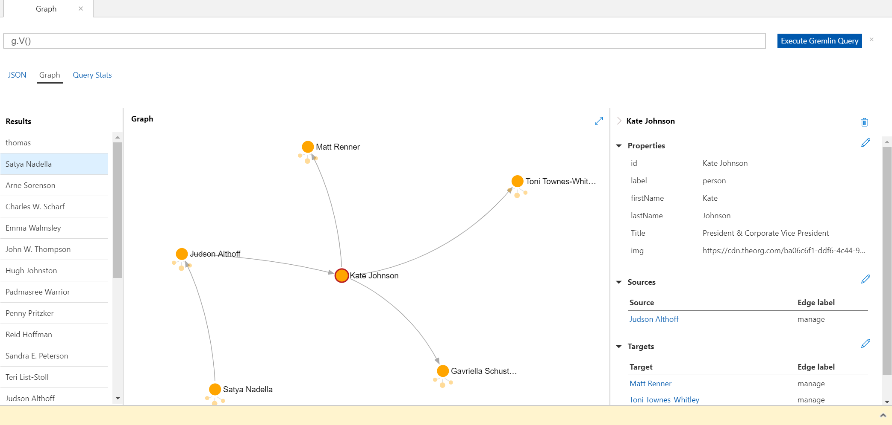

# AZ-204 Demo: Graph API

In this demo you will find out how to use Graph API of Cosmos DB

## Before delivery:

- Deploy and Prepare Cosmos DB with Gremlin API.
- In VS code open folder **.\gramlin-demo\\**
- Install packages by command **npm install**
- Update your connection settings in `config.js`
- Run the project from command line **node .\app.js**

## In class:

1. Open Graph Cosmos DB. 
2. From data explorer navigate though the links:

### Satya > Jadson > Kate

