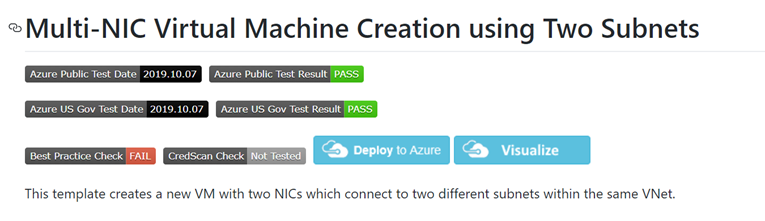
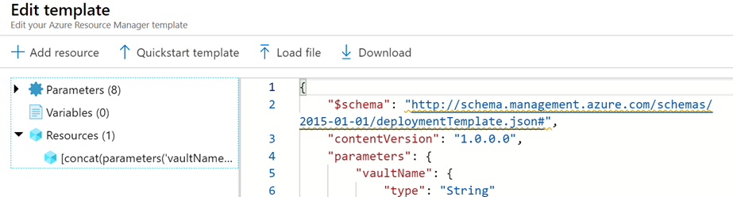

# AZ-204 Demo: Create Resource Manager templates by using the Azure portal

In the demo you will build template from github repository.

## In class:

1. Navigate to GitHub [template folder](https://github.com/Azure/azure-quickstart-templates)

1. Select template to build. eg `101 VM with 2 NIC`
2. Click **Deploy to Azure** button on the template MD file

1. Fill out parameters.
2. Demonstrate template content by clicking on `Edit template`.

1. Start deploying
2. When the deployment don demonstrate result.
3. If time permit demonstrates another template for wide environment, you already built.