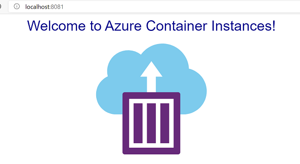

# AZ-204 Demo: Run Docker image locally

In the demo you will download and run Docker image locally.

## Before delivery:

- Install Docker Desktop
- Download image from Docker Hub. Open in VS Code **demo.cli** and run lines for pull

### !!! The images are heavy ~1.5Gb, so download in advance !!!

## In class:

1. Docker desktop must be run.
1. Open in VS Code **demo.cli** and run lines with `docker run`
1. Start local web site and visit 

1. Send the Cat to the Moon

1. Watch underwater 

