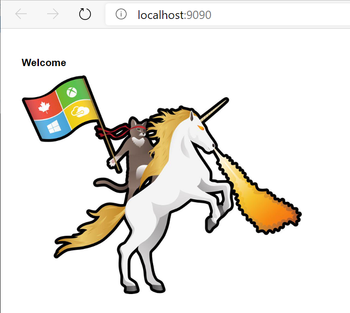
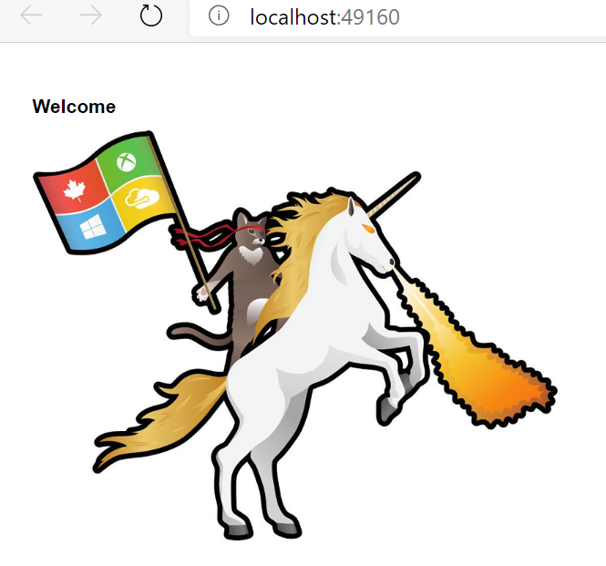

# AZ-204 Demo: Run Docker image locally

In the demo you will create new image from web site

## Before delivery:

- Install Docker Desktop
- Open in VS Code **Nodejs** folder with web site.
- Test that site is running by use play button

## In class:

1. Docker desktop must be run.
1. Open in VS Code **Nodejs** folder with web site.
1. Run the web site locally by use play button. http://localhost:9090

1. Open/Create `DockerFile`.
1. Open **run.azcli** to build image. Script should be executed in the project folder.
1. Run line by line and explain result.
1. Open localhost to make sure that container created and run successful.

S

1. Run the command from script to list the images stored locally.