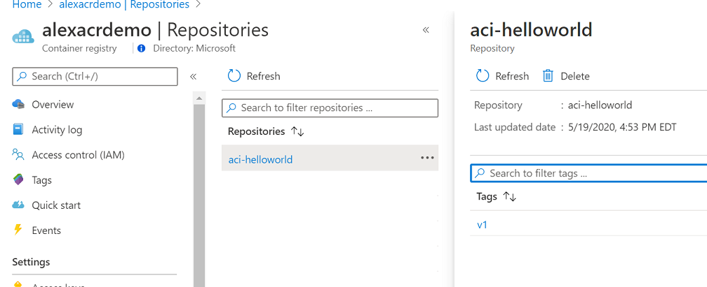

# AZ-204 Demo: Deploy an image to ACR by using Azure CLI

In the demo you will deploy container you build before

## Before delivery:

- Install Docker Desktop

## In class:

1. Docker desktop must be run.
1. Open in VS Code script `deploy-extra.azcli`.
1. Execute line by line
1. Demonstrate ACR with the image

