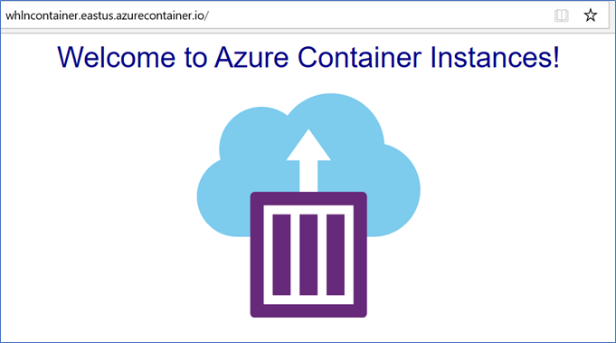

# AZ-204 Demo: Deploy a container to ACI

In the demo you will create container instance based on images you upload.

## Before delivery:

- ACR should contains image(s) you upload in previous demos

## Demo in class

1. Run `demo.azcli` to create ACI instance. Navigate to the ACI web site and confirm that is works as expected.

> Note that Nodejs container is working on 9090 port.

1. From Azure portal navigate to ACR and ACI and explain what script deployed.
