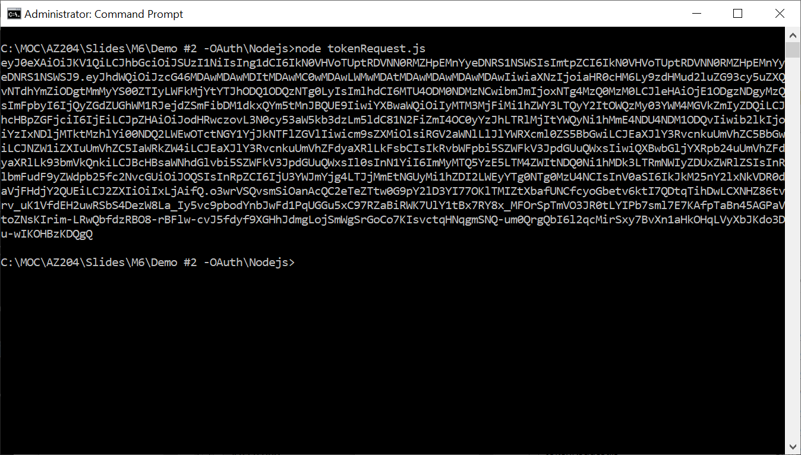
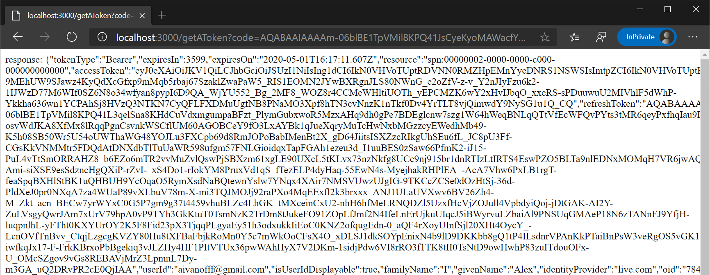

## AZ-204 Demo: OAuth in Action (MDAL)

In the demo you will build application to request token by use MDAL libraries.

## Before delivery:

- Open **Nodejs** folder in VSCode.
- Update `.env` file  with values from your tenant and App you registered in previous demo.
- Test token generation by command:  **node .\tokenRequest.js**

## In class:

1. Open **Nodejs** folder in VSCode and generate token:  **node .\tokenRequest.js**

1. Run in VSCode Web Site to obtain the token by OAuth protocol. 
1. Run command **node .\index.js** The web site will be started on port 3000
1. Click "log in" link and provide your credentials.

### User browser in private mode to avoid any issues with SSO!

