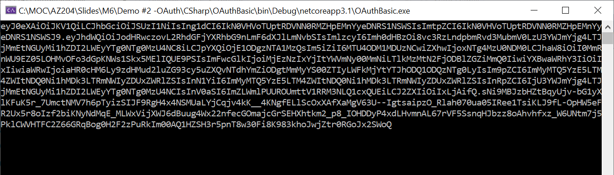

## AZ-204 Demo: OAuth in Action

In the demo you will build application to request token by use MDAL libraries.

## Before delivery:

- Open **CSharp\OAuthBasic.sln** file in VS.
- Update `appsettings.json` with values from your tenant and App you registered in previous demo.
- Test token generation by running project 

## In class:

1. Open **CSharp\OAuthBasic.sln** file in VS.

