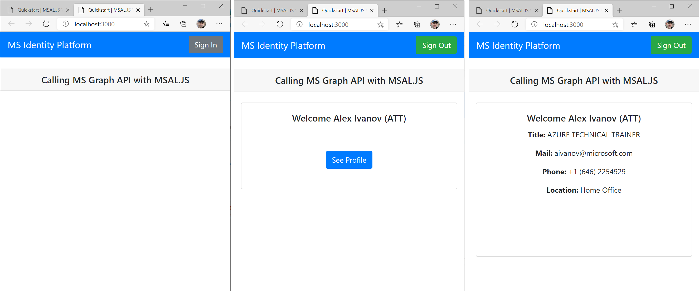

## AZ-204 Demo: Interactive authentication by using MSAL

In the demo you will use MSAL libraries to request token and access to Microsoft Graph

## Before delivery:

- Check your app registration settings: 

- Open **Nodejs** folder in VSCode.
- Update `authConfig.js` file  with values from your tenant and App you registered in previous demo.
- Run local website command:  **node .\server.js**

## In class:

1. Open **Nodejs** folder in VSCode and generate token:  **node .\server.js**
1. Open browser on http://localhost

1. Run command **node .\server.js** The web site will be started on port 3000
1. Click "Sign in" button and pull data from Graph API

### User browser in private mode to avoid any issues with SSO!

