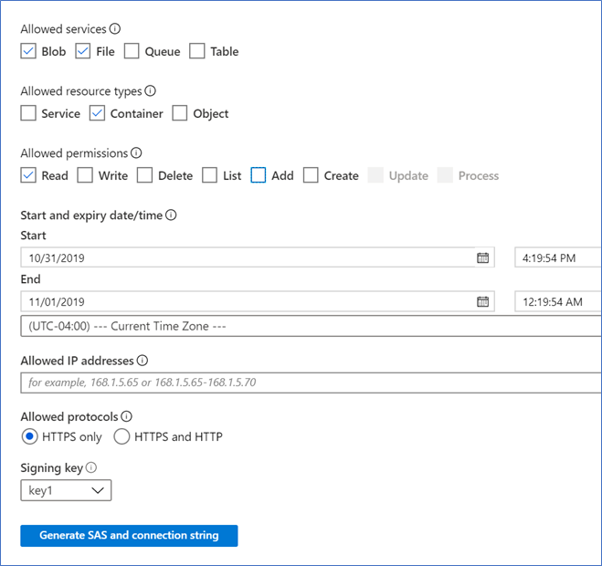

# AZ-204 Demo: Azure Blob SAS

In the demo script you will create SAS signature and get access to the private images by use SAS

## Before delivery:

- Reuse already existed storage account.

## In class:

1. Open storage account in Azure portal and demonstrate Primary Key and Secondary Key with connections strings.
2. Explain Key permission and rotation key compliance requirements
3. Generate SAS for Read of the Blob

1. Connect table in **Azure Storage Explorer**
2. Demonstrate you can list the files.
3. Try to change a filed in the item, you should fail because the SAS is for Reading.
4. You might upload IMG file and request it directly from browser by coping link – result 404
5. You might generate signature for the then request files by signature and get the file.