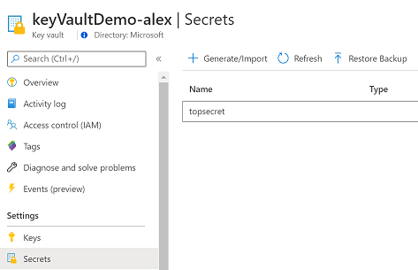

# AZ-204 Demo: Create Azure Key Vault  with CLI

In the demo you will create a new Keyvault from Azure CLI

## Before delivery:

- in the script **demo.azcli** replace your $appID with your App ID registration account created in the previous demos

## In class:

1. Open in VS Code or Cloud Shell **demo.azcli**
1. Execute script line by line
1. Check if the Key Vault create on the Portal

