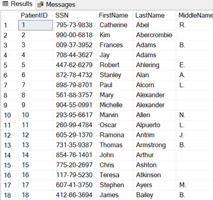
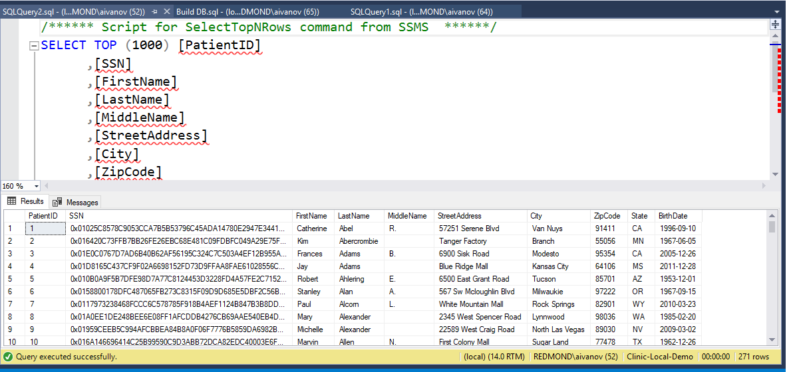
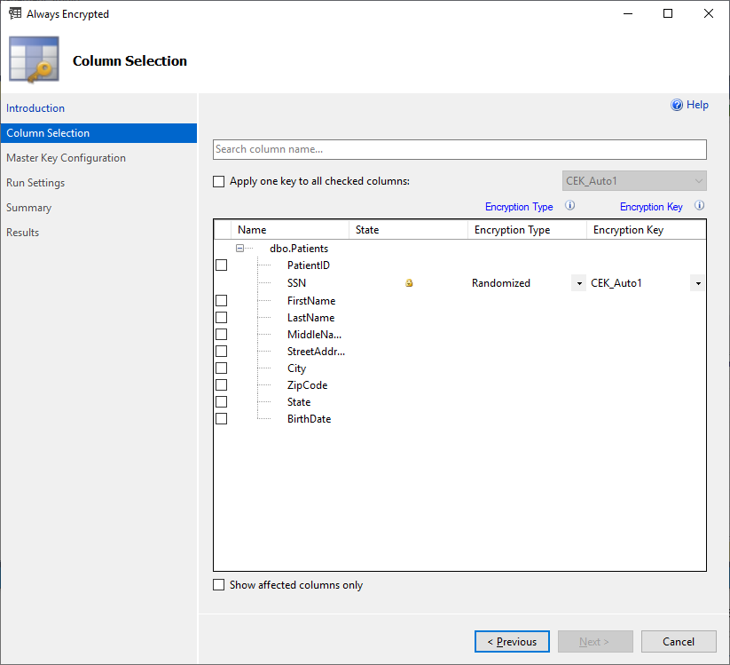
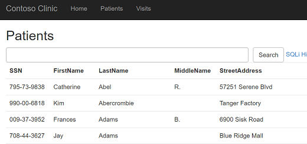

# AZ-203T04A-02 Demo #7: Always Encrypt

In the demo you will deploy contos-clinic Web App and Azure SQL Database.
You will implement Always encrypt option and observer changes from Web Portal.

The same encryption can be setup on SQL VM.

## Before delivery:

Demo code was taken from the [repo](https://github.com/microsoft/sql-server-samples/tree/master/samples/features/security/contoso-clinic)

## In class:

1. Demonstrate original table from DB

1. Demonstrate encrypted table

1. And setting from SSMS

1. Check the web site

1. If time permit demonstrate TDE from following [tutorial](https://docs.microsoft.com/en-us/azure/azure-sql/database/transparent-data-encryption-byok-overview)