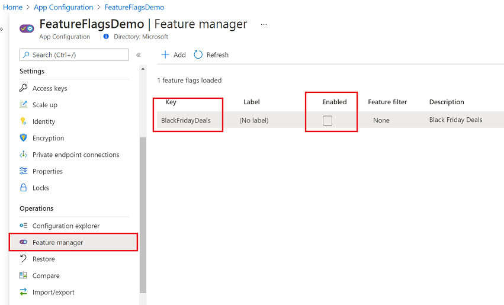
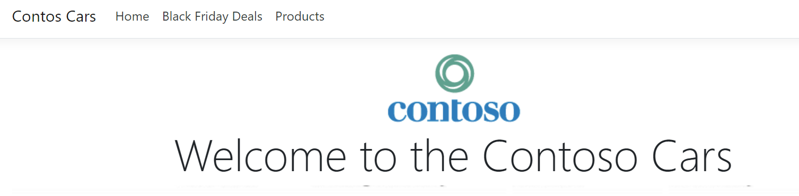

# AZ-203T04A-02 Demo #5: Feature flag

In the demo you will deploy contos-cars Web  with App settling instance to enable/disable Black Friday Deals.

## Before delivery:

Create new App Settings instance and Feature Flag "BlackFridayDeals"

Demo code was taken from the [tutorial](https://docs.microsoft.com/en-us/azure/azure-app-configuration/quickstart-feature-flag-aspnet-core?tabs=core2x)

## In class:

1. Turn the feature flag OFF and run Web App from local host. Demonstrate that no *Black Friday Deals* page in the menus.

1. Stop the Web App and from the portal enable flag. Run the Web App again and demonstrate that deals comes in the menu. 

1. Click on the link to demonstrate page.

1. Stop the Web App and Turn the feature flag OFF return to the Web App and demonstrate results.

