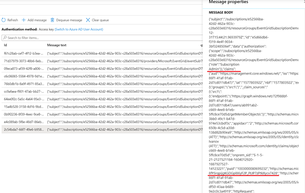

# AZ-204 Demo: Create a custom EventGrid by using the Azure CLI

In the demo you will create new EventGrid subscription by use Azure CLI script for resource group changes. Then test it from the portal.

## Before delivery:

- Create storage account queue
- Create Resource group for monitoring
- Update values in the script `demo.azcli`

## In class:

1. Run the script
1. Demonstrate Event Subscriptions created from portal:

1. Navigate to the group and modify the group. Deploy new resource or add tag.
1. After a few seconds you should see the messages in the queue.
1. In this time you can check messages in the target queue.

Explain that following message for format. Eg. Claim was requested likely for access to azure graph and if you scroll down you should see the claim and IP address of requester.

