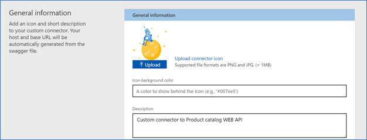
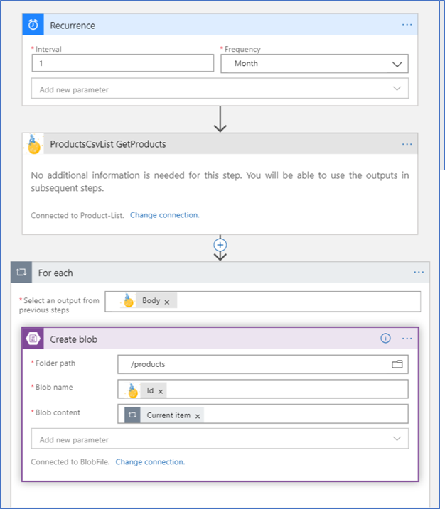

# AZ-204 Demo: Create a custom connector in Logic Apps

In the demo you create custom connector to read product list from Web API and save the list of the products in storage account in files.

## Before delivery:

- API Apps application. You can reuse exited application from APIM or build the new. 
  [Basic API sample](https://docs.microsoft.com/en-us/samples/microsoft/powerapps-samples/web-api-basic-operations-sample/)

- Swagger documentation should be downloaded as file.

- Custom connector created as new Azure Resource **Logic App Custom Connector**

## In class:

1. Demonstrate WebApp and Swagger

1. Demonstrate Custom Connector

1. Create new Logic App from template triggered by schedule and add operation from custom connector

1. Provide access to storage account where files will be created.

1. Run the Logic App

1. Demonstrate created files.

