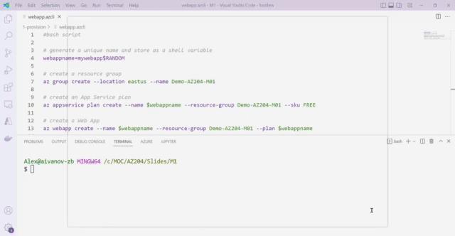

# AZ-204 Demo: Create Web App from Azure CLI

In the demo, you will create an empty Web App from Azure CLI and access to the Web App by HTTPS

## Technical Requirement
- Azure CLI or Cloud Shell  
- VS Code 

## Demonstration

1. Open `webapp.azcli` and execute commands line by line.

1. When deployment finished you can observe Web App from portal and check out the website URL.

## Recoding

## Reference

Follow the [guides](https://docs.microsoft.com/en-us/learn/modules/host-a-web-app-with-azure-app-service/2-create-a-web-app-in-the-azure-portal) to deploy new Web App.

