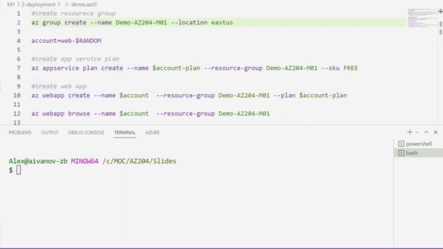

# AZ-204 Demo: Azure Web App Deployment

In the demo you will create new Web App from Azure CLI and deploy web app from Zip Archive. 
Then you will set up continues integration from GitHub Repository.

## Technical Requirements:

- Install VSCode and Azure CLI Tools.
- All scripts should be run from the demo folder.

> The GIT deployment made for the public [repo](https://github.com/true-while/secure-web-https.git). In case of the insufficient rights you can fork the repo and update its adders in the script.

## Demonstration:

1. Open VSCode and run the script **demo.azcli** line by line
2. Check the result on the web app – should be a test page.

3. Deploy Web App from Zip archive and verify the deployment from browser: 

4. Setup [CD deployment from github](https://docs.microsoft.com/en-us/azure/app-service/deploy-continuous-deployment)

> Note: you can use following git repo for your demo **https://github.com/true-while/secure-web-https.git**

5. After configuring CI with github repo verify the result in browser:

## Recoding

## References:

PowerShell deployment  tutorial could be find [here](https://docs.microsoft.com/en-us/azure/app-service/scripts/powershell-deploy-staging-environment)