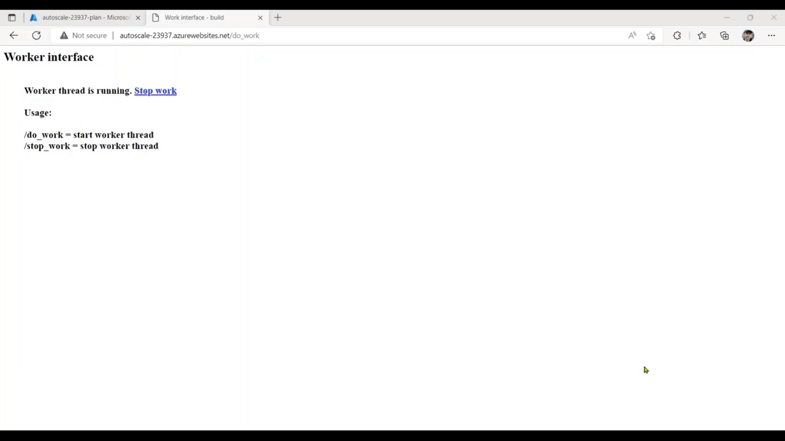
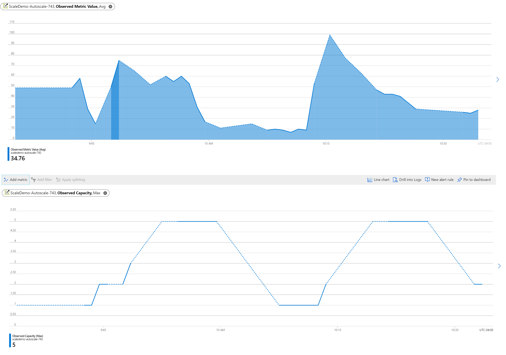

# AZ-204 Demo: Autoscale Azure Web App by using performance metrics

In the demo you will build Python app to generate CPU load. 
Then you will set up CPU autoscale rules and monitor scaling in and out.

## Technical Requirements:

- Azure CLI
- VS code

## Demonstration:

1. Open `demo.azcli` and execute commands line by line and deploy website. Observe created rules from the Azure Portal

    

1. Open deployed Web App and click "start work" to start workload. 

    

1. Monitor autoscaling history and stop the workload when the wab app scaled for more then 1 instance. 

    

1. When the workload finished the web app should scale in back to 1 instance.

    

