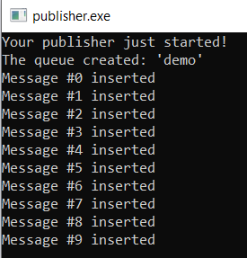
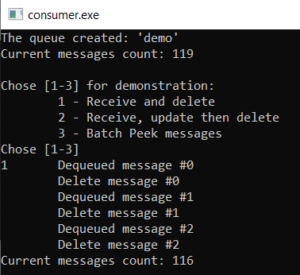

# AZ-204 Demo: Processing messages from the code

In the demo, you will leverage message publisher and message consumer to connect the Azure Storage Queue and operate with messages.

## Technical requirements:

- Visual Studio Code
- Net 6.0

## Demonstration:

1. Open [**Publisher**](publisher)  project and locate `Program.cs`.

1. In the code of the `Program.cs` update the connection string with your connection info from the Azure Storage Queue created from previous demo.

1. Build and run the `publisher` that send a few messages in the queue. You can observer the messages from Azure Portal by using Storage Explorer.

1. Repeat the same steps with updating `Program.cs` for [**Consumer**](consumer) project.

1. Build and run the `consumer` that receive the messages sent by `publisher`. 

1. [1] option demonstrate you receiving 3 messages and explicit delete; [2] option demonstrate you receiving and updating messages with explicit delete it later. [3] option will peak messages to observe without deletion.

