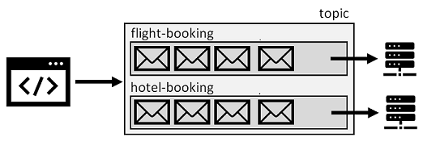
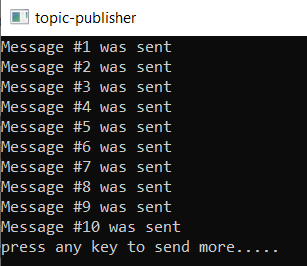
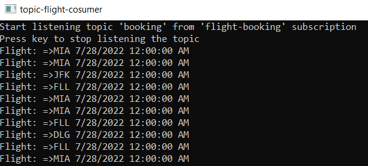
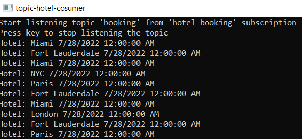

# AZ-204 Demo: Send and receive messages from a Service Bus Queue

In the demo, you will use console applications to send and receive messages from topic. The booking consist of the Hotel and Flight part. Both booking parts will be received by each of the consumer through the topic subscription and proceed separately.

## Technical requirements:

- Azure CLI or Cloud Shell
- .Net 6.0

## Demonstration:

1. Open **topic-demo/publisher**  project and locate `Program.cs`.

1. In the code of the `Program.cs` update the connection string with your connection info from the Azure Service Bus Queue created from previous demo.

1. Build and run the `publisher` that send a few messages in the queue. You can observer the messages from Azure Portal by using Service Bus explorer. Do not close the publisher to send more messages later.

    

1. Repeat the same steps with updating `Program.cs` for **/topic-demo/flight-booking** project.

1. Build and run the `flight-booking` that receive the messages sent by `publisher`. 

    

1. Repeat the same steps with updating `Program.cs` for **/topic-demo/hotel-booking** project.

1. Build and run the `hotel-booking` that receive the messages sent by `publisher`. 

    

1. You can return back to the publisher console to sent more messages and observe messages on the subscribers in real time. 
