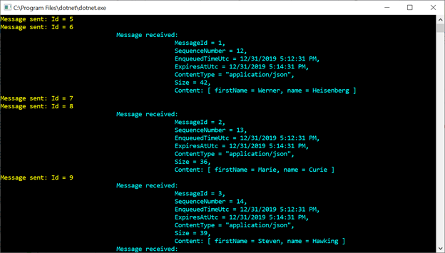

# AZ-204 Demo: Send and receive messages from a Service Bus queue

In the demo you will send and receive messages from Azure Service Bus

## Before delivery:

- Open project `ServiceBusDemo\ServiceBusDemo.sln` from VS 
- Update hardcoded connection string in **Program.cs**

## In class:

1. Run the project to send and receive messages from  Service Bus
1. Demonstrate output and explain with the code.

