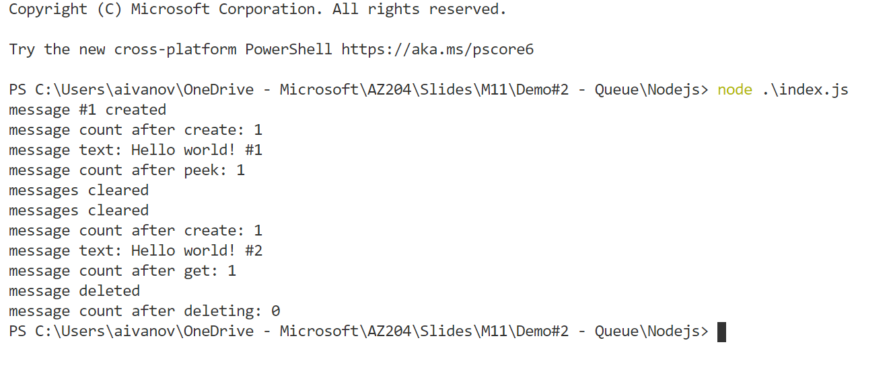

# AZ-204 Demo: Send and receive messages from a Service Bus queue

In the demo you will send and receive messages from Azure Service Bus

## Before delivery:

- Open folder `Nodejs` from VS Code 
- Update hardcoded connection string in `.env`

## In class:

1. Run the following command to send message **node .\index.js**

