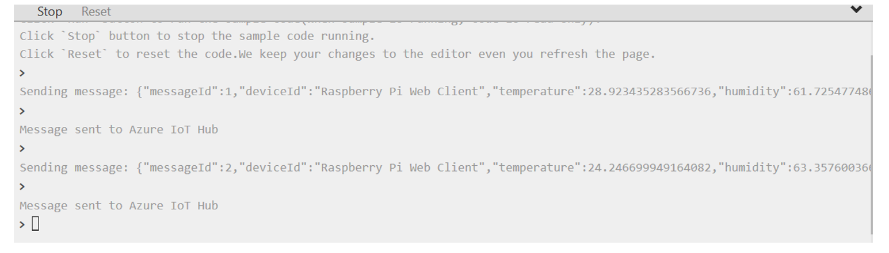
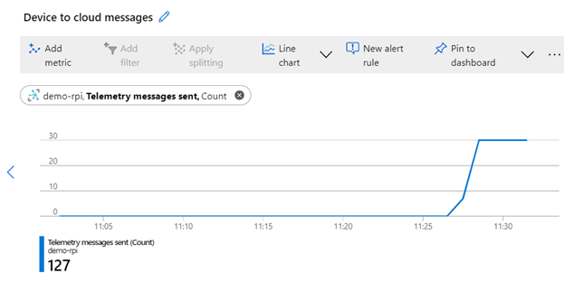
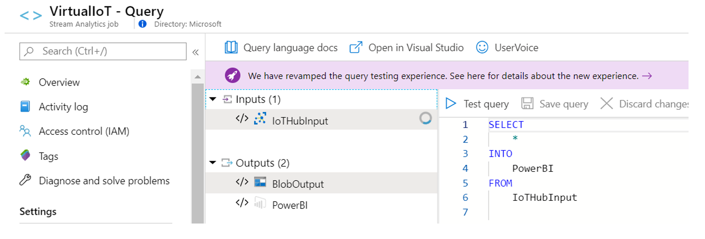
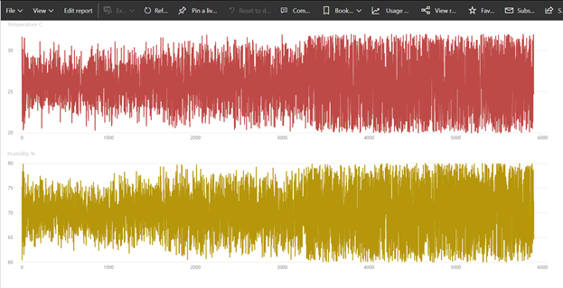

# AZ-204 Demo: IoT Hubs in Action

In the demo you will run Virtual Raspberry Pi and monitor telemetry from Azure Portal and Power BI.

## Before delivery:

- Following [guidelines](https://docs.microsoft.com/en-us/azure/stream-analytics/stream-analytics-get-started-with-azure-stream-analytics-to-process-data-from-iot-devices) help you set up Azure environment. 
- The setup you can find following [guidelines](https://docs.microsoft.com/en-us/azure/iot-hub/iot-hub-raspberry-pi-web-simulator-get-started)
- Create IoT Hub
- Register virtual device and copy **connection string**.
- Build Azure Stream Analytics as explain in guidelines.
- Power BI subscription can be started in free trial.

## In class:

1. Demonstrate IoT Hub
1. Demonstrate Device Registration and two ways communication.
1. Open [virtual simulator](https://azure-samples.github.io/raspberry-pi-web-simulator/)
1. Update **connection string** copied previously
1. Run the virtual device and demonstrate events going to the Iot Hub

1. In few minutes on the Iot Hub demonstrate statistics

2. If time permit set up Stream analytics to send messages to Power BI

3. And Power Bi report Temp/Hub by messageID

