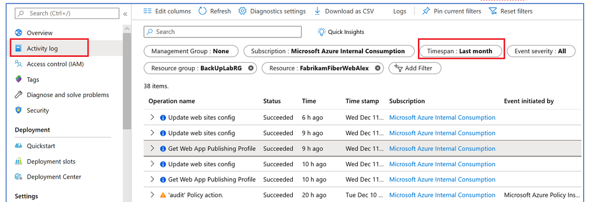
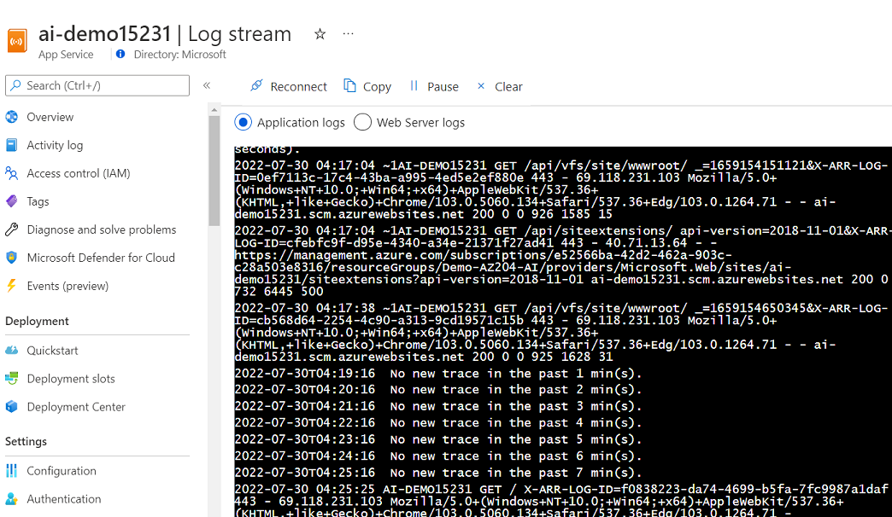
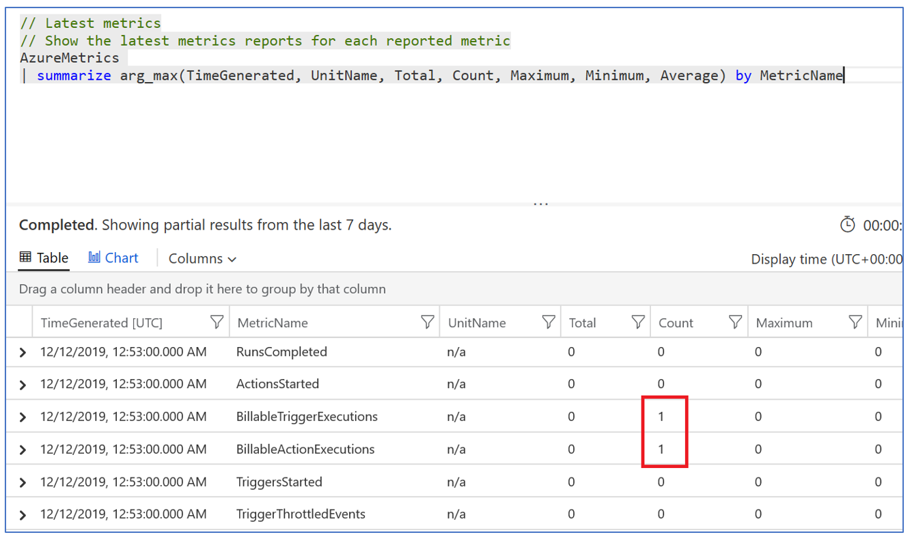

# AZ-204 Demo: Exploring Azure Monitor

In the demo you will provision Web App and enable Monitoring and Diagnostic for the service.

## Technical requirement.

- Azure CLI or Cloud Shell

## Demonstration

1. Open `demo.azcli` and execute line by line to provision Web App.

1. Make several requests to the Web App to generate activities for metrics.

1. From the first page demonstrate the base telemetry.
 


1. From the `web app` select `Audit Log` and demonstrate log tracked by Azure Monitor.



1. From the `Monitoring` section select **Log Stream** to observer the output in live mode



1. Find `Logs` from the `Monitoring` section. 

    ```SQL
    AzureMetrics 
    | summarize arg_max(TimeGenerated, UnitName, Total, Count, Maximum, Minimum, Average) by MetricName
    ```
