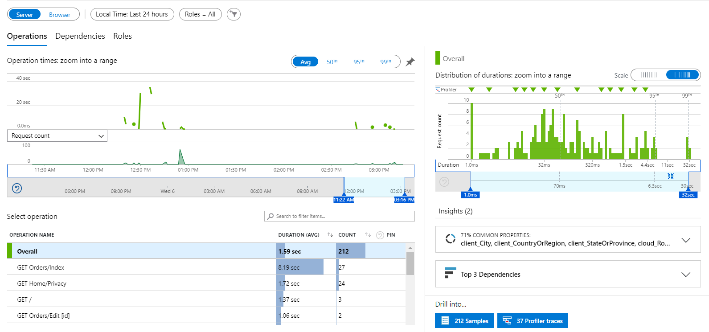
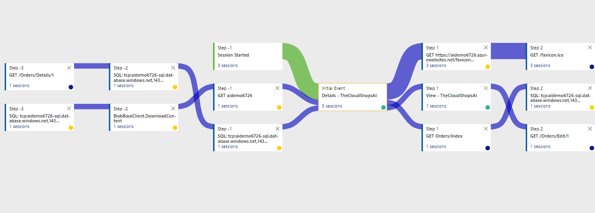

# AZ-204 Demo: Integrate your code with Application Insights

In the demo you will observer the code and deploy it to provisioned environment: Web App and SQL Database.

## Technical requirement.

- Azure CLI or Cloud Shell
- Visual Studio
- Net Core 6.0

## Demonstration

1. Open `demo.azcli` and execute line by line to provision Web App, SQL DB and Storage account.

1. Open project *DemoProject* and update **ConnectionString** string in `appsettings.json`. You need to provide instrumentation key. The key can be found on the portal for AI instance with the same as website.

1. Run script `deploy.azcli` to deploy the code to the provisioned web site.

1. Make several requests to the Web App to generate activities for metrics.

1. From AI portal observer `Performance`.
 

1. From the `User Flow` select event you are interested in and observer the graph of user flow.

> In the next demo you will keep investigating Map and Exception that help you troubleshot the app.