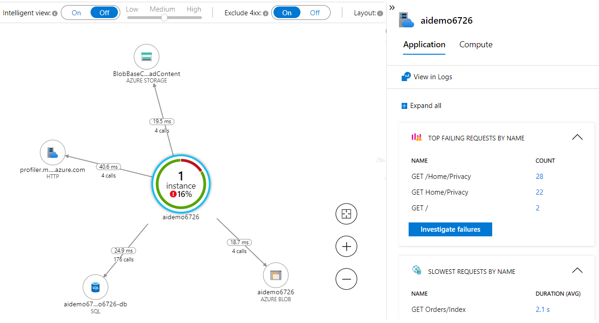

# AZ-203 Demo : Troubleshooting with AI.

In this demo you will find out how to use Application Insights Map and troubleshot exceptions. 

## Technical requirements:

- App Insights instance you setup before.

## Demonstration:

1. From the Azure portal find and open the `Application Map`. After a few minutes after the requests you made for your website you should see the instance of DB and Storage Account and Web site on the map.

    

1. Set mouse pointer to  DB to see statistics.

1. You also can observe the SQL commands that send to the SQL DB when you choice exact page request. 

1. Check errors count and navigate to the error list

    

1. Click on `investigate failure` to get more about errors.

