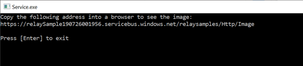
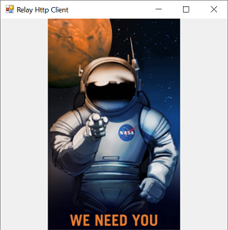

# AZ-204 Demo: Azure Relay In Action

In the demo you will use Azure Relay to send images between server and client

## Before delivery:

- Create Azure Relay
- Obtain connection string 
- Update connections strings in the files `azure-relay-config.properties`

[https://github.com/Azure/azure-relay/tree/a7b9eb44b045ec82b082515a453dc81159cb6b4a/samples/wcf-relay/RelayHttp](https://github.com/Azure/azure-relay/tree/a7b9eb44b045ec82b082515a453dc81159cb6b4a/samples/wcf-relay/RelayHttp)

## In class:

- Demonstrate relay from azure portal
- Run the server

- When the server connected run the client (original image replaced by NASA&#39;s one)

- Run another client, and another client.
- Shutdown the server and run the client again.
- Explain why the error comes, because the server shutdown or lost connection.