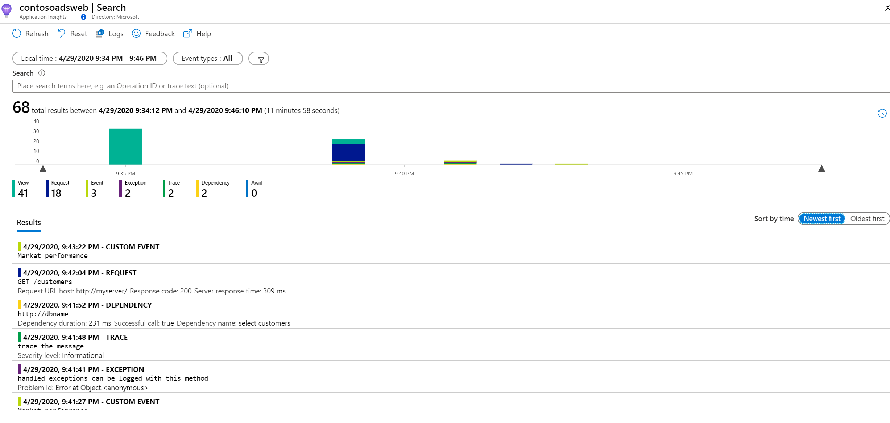

# AZ-203T05A-01 Demo: Application Insights in action

In this demo you will enable AI for you web application. 

## Before delivery:
 
 - Create new instance of App Insights form Azure Portal.
 - Obtain Instrumentation Key from App Insights instance.
 - In VS Code open folder **Nodejs** locate `index.js` and update `apikey` with your value.

## In class:

1. Run project by command **node .\index.js**

1. Open Web Browser and navigate to http://localhost:8080.

1. The request and response will be tracked in your App Insights instance. Be aware that it takes a few minutes to get them loaded and processed and appearers on interface. "Development" settings can slightly decries interval. 

1. Your `log search` should looks like following: 

