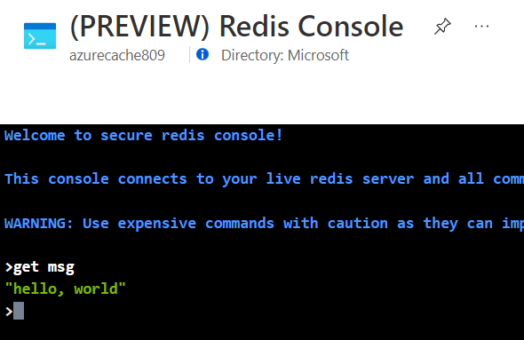

# AZ-204 Demo: Provision Azure Cache for Redis

In the demo you will provision an Azure Cache for Redis instance, get connected to the from the portal console and run a few commands.

## Technical requirements:

- Azure CLI or Cloud Shell
- redis-cli tool 

## Demonstration:

1. Open **demo.azcli** and execute the commands line by line.

1. Copy the Redis Key from the output and save it for future use.

1. Update Run CMD file with the key you copied.

1. Run the CMD and execute following command:

    **set msg "hello, world"**

    **get msg** 

1. Open Azure portal and find the provisioned instance. Open the web console and run command to get your value set before.

    **get msg**

    

## References

1. Redis commands: https://redis.io/commands#

1. Download console redis cli: https://github.com/MicrosoftArchive/redis/releases
