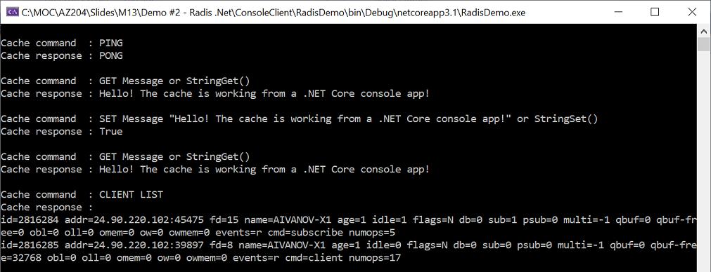

# AZ-204 Demo: Azure Cache for Redis in Action

In the demo you will build a Redis in Azure and get connected to the Redis service from console.

## Technical Requirements:

- Azure Cache For Redis deployed from previous script. 
- VS Code 
- Net 5.0 

## Demonstration

1. Open in VS Code folder `ConsoleClient\CSharp` and update file `appsettings.json` with your connection string to Azure Cache.

1. Run the project and observe output 

