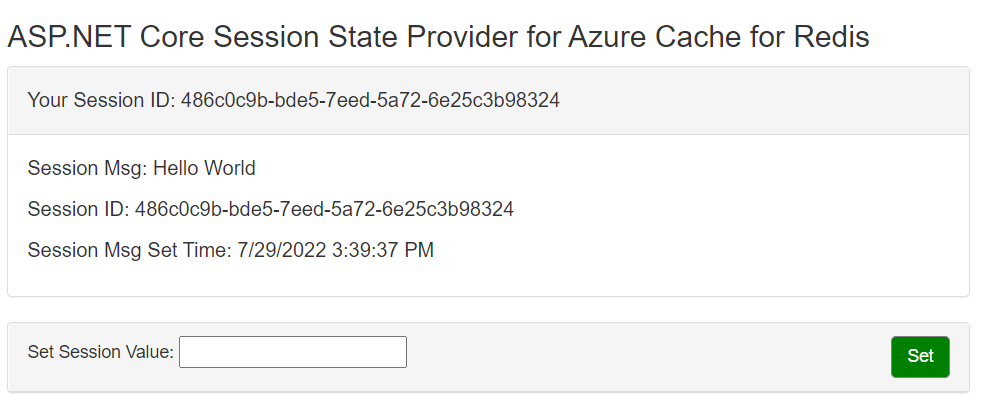

# AZ-204 Demo: Session State for Azure Cache for Redis

In the demo you will use session connector to the save users values in Azure Cache for Redis.

## Technical Requirements:

- Azure Cache for Redis instance previously deployed
- VS Code
- ASP NET Core 5.0

## Demonstration

1. Open *appsettings.json* file and update `AzureRedis` with connection string to your Azure Cache. 

1. Run the web app locally or deploy to the Azure Web App.

1. From the browser navigate to the web app. The session info on the page should be empty. Enter any value to the text field and hit button to set the value in the session. 

1. Page will be automatically refreshed and demonstrate the value and time when it set.

    

1. Stop and restart the server, but do not close the page.

1. Refresh the page the value should still appears.

1. Stop the web site for > 1 min and run the web site again. The session values should be cleared because of TTL on the values in Azure Cache for Redis.