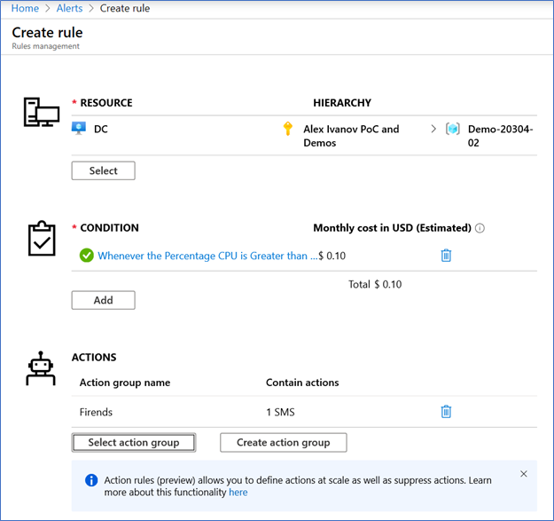

# AZ-203T05A-01 Demo #3: Create an alert

In this demo you will create new Alert for VM based on CPU.

## Before delivery:

- none

## In class:

1. Create new Alert for VM CPU > 70%

1. Demonstrate Action group

1. Start VM and get alert (moody threshold to get alert eg > 10% )

1. Demonstrate alert when you receive it.