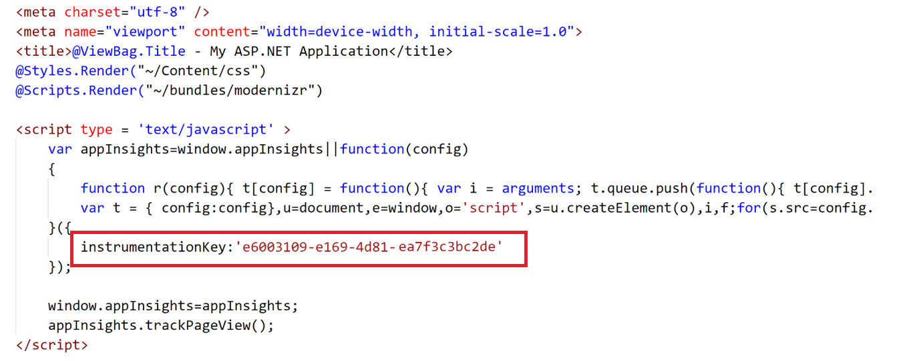
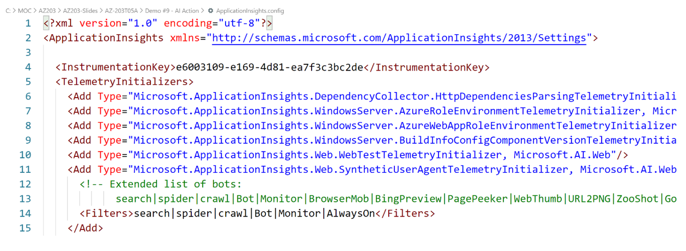

# AZ-203T05A-01 Demo: Application Insights in action

In this demo you will enable AI for you web application. 

## Before delivery:
 
 - Create new ASP.NET Web App
 - Create new instance of App Insights form Azure Portal.
 - Obtain Instrumentation Key from App Insights instance.

## In class:

1. From open project locate `_Layout.cshtml` and provide code snipped as you find `CSharp\HTML+JS\_Layout.cshtm`. Update your App insights instrumentation key.

1. You also can use App Insights from the Java Script code to track the events, errors, messages.

1. You also can add following code to C# Controller like following example:

- In Method GetFile:

1. You can configure specific features directly 

