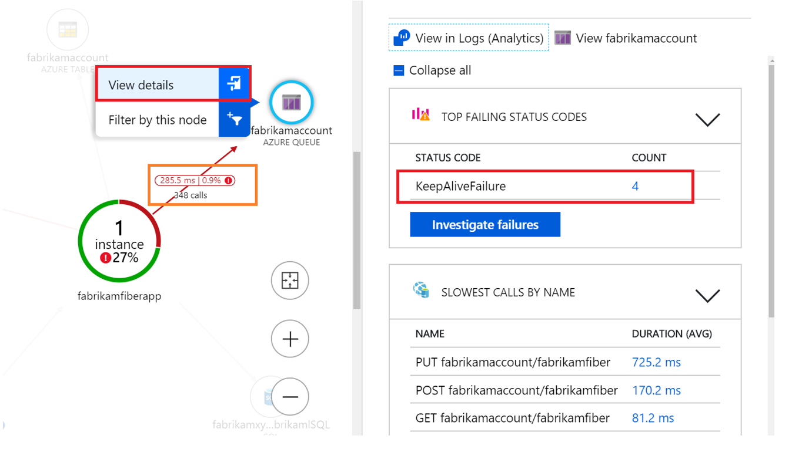
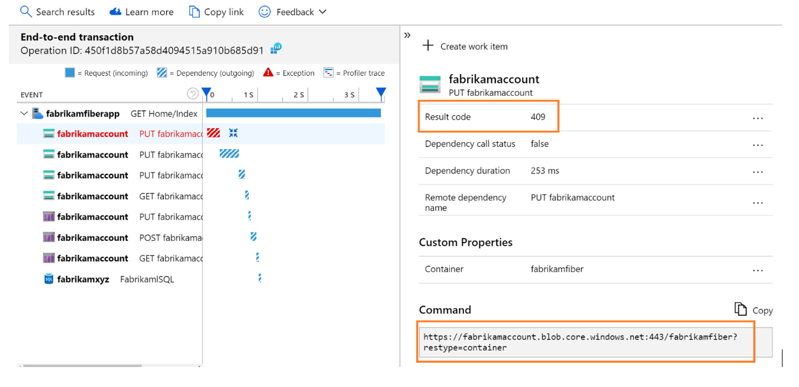

# AZ-203 Demo : Application Map

In this demo you will find out how to set up and use Application Insights Map

## Before delivery:

- reuse the App Insights instance you set up before.

## In class:

1. Open App MAP

2. Set mouse pointer to see statistics.

3. Check errors count and navigate to the error list

4. Click on `investigate failure` to get more about errors.

5. Demonstrate error analyzing

