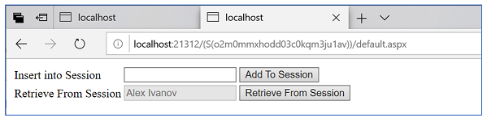

# AZ-204 Demo: Azure Cache for Redis in Action

In the demo you will use session connector to the save users' values in Redis cache.

## Before delivery:

- Create Redis instance in Azure
- Update `Web.Config` with your Redis instance parameters:

- For successful run demo customer networks should allowed communication to Redis.

- Non-SSL port (6379) enabled

## In class:

You will demonstrate who session values can be hosted in Redis (for scalability your application).

1. Run the web project.
2. Web site should be open automatically with start page.
3. Copy the URL – it contains your session identifier. Next time you can return to your session by this identifier.
4. Enter the test value and set the value in session. Click &quot;Add to Session&quot; to save the value.
5. Click &quot;Retrieve from…&quot; to read the value from session.
6. Stop debugger and close the Web browser.
7. You can demonstrate the code of the page. It has simple call to **Session["ModuleName"]**

8. You can restart VS, IIS or whole computer.

9. Run the project again and paste the URL you copy before. You will be able to return to your old session. (it use cookless session)

10. Click on the button `Retrieve from…` to read the value from session (Redis).

