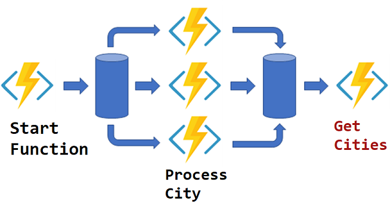

# AZ-203T Demo: Durable Function in C#

### In this demo you will run locally durable function FunIn-FunOut. The function will call the City's function for each of the City.

## Technical Requirements:

- Visual Studio Code
- [Postman](https://www.postman.com/downloads/) to test Web API

## Demonstration

1. Open project _ **DurFunDemo.sln** _

1. Update _ **local.settings.json** _with your storage account connection string

1. Run the function

1. Pick the link and request from Postman.
2. Follow the first link in output

1. Repeat call until getting result.

