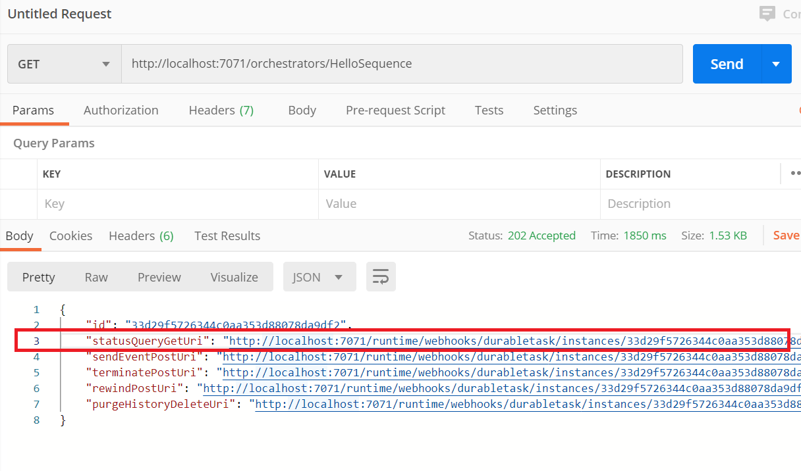

# AZ-204 Demo: Durable Azure Function

### in this demo you will run durable function Chain Function locally:


## Technical Requirements:

- Visual Studio Code
- Node 16 or higher
- [Postman](https://www.postman.com/downloads/) to test Web API

## Demonstration

1. Update storage account reference from `local.settings.json` 

    ```JSON
    { "AzureWebJobsStorage": "<your storage account connection string>" }
    ```

1. Open folder in VS Code and run following command in terminal: **npm install** 

1. Run the Function locally from VS Code by use **play** button. Monitor `terminal` to make sure it is started without errors.

1. Use **Postman** to test function like explained bellow.

1. Use postman to send GET request to  **http://localhost:7071/orchestrators/ChainFunction** 



1. Send additional request to provided url by use postman to obtain the results.


