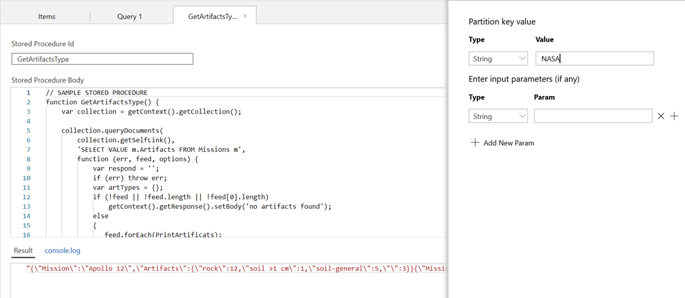

# AZ-204 Demo: Querying Cosmos DB (SQL)

In this demo you will create new Cosmos DB container and upload initial data. 
Then you run some query to find the documents and analyze performance.


## Import data 

1. Prepare Cosmos DB New collection `Apollo` and container `Missions`. Chose `/Operator` as partition.
1. Import Apollo files from folder `Apollo`

### Optional
1. Create Stored Proc from **sp.js** file
1. Create UDF from **udf.js** file
1.  Create Pre Insert/Update Trigger from **trigger.js** file.

## Demonstration

1. Open Cosmos DB `Data Explorer`
2. Open `new` and `query`, run queries and demonstrate statics (RU)

**SELECT\*FROM c**

1. Run updated query and demonstrate statics (RU)

**SELECT c.id,c.Operator,c.Crew.Members FROM c**


1. Simple query to any JSON document. Table name is up to you or can be missed.

**SELECT \* FROM Apollos m**

1. Select all Apollo mission by id

**SELECT \* FROM Missions m where m.id = &#39;Apollo 10&#39;**

1. Like query is not supported by you can use CONTAINS or STARTWITH

**SELECT \* FROM Missions m where CONTAINS(m.id,&#39;Apollo&#39;)**

1.  In the same we can use &#39;IN&#39;

**SELECT \* FROM Missions m WHERE m.id IN (&#39;Apollo 11&#39;, &#39;Apollo 17&#39;)**

1. OR even CONTAINS in Array Type fields Like Crew=\&gt;[Members..]

**SELECT \* FROM Missions m where ARRAY\_CONTAINS(m.Crew.Members,&quot;Neil A. Armstrong&quot;)**

1. You can query more than 1 level of the data and takes the fields with space in the brackets

**SELECT \* FROM Missions m WHERE ARRAY\_CONTAINS(m[&quot;Spacecraft properties&quot;].Spacecraft , &quot;Apollo LM-6&quot;)**

1. You can also modify output data. Following query will give us all missions crew members.

**SELECT m.id,m.Crew.Members FROM Missions m**

1. Or format output in to another json. Value – to get just resulted properties without additional fields

**SELECT VALUE {&quot;Mission Name&quot;: m.id, &quot;Commander&quot; : m.Crew.Members[0], &quot;Module Pilot&quot; : m.Crew.Members[1]} FROM Missions m**

1. You also can use function to calculate length of array. Following example will calculate amount of useful artifacts by missions.

**SELECT VALUE {&quot;Mission Name&quot;: m.id, &quot;Artifacts count&quot; : ARRAY\_LENGTH(m.Artifacts)} FROM Missions m**

1. Using joins is quite different from SQL. We can join the document to itself to change nesting levels. For example, following list will provide all crew members by mission in flat format. Sub query and cross document joins is not supported.

**SELECT m.id, memeber FROM Missions m JOIN memeber IN m.Crew.Members**

1. You can also use TOP and ORDER criteria. The order criteria work with string/number not with dates that is why result is sorted A-Z

**SELECT TOP 5 m.id,m[&quot;Start of mission&quot;][&quot;Launch date&quot;] FROM m ORDER BY m[&quot;Start of mission&quot;][&quot;Launch date&quot;]**

### Optional

1. Run following query to demonstrate UDF and find the launch pad 39A/B:

```sql
SELECT m.id,m[&quot;Start of mission&quot;][&quot;Launch site&quot;]

FROM Missions m

WHERE udf.Match(m[&quot;Start of mission&quot;][&quot;Launch site&quot;],&quot;39[AB]&quot;)
```

1. Run stored proc to demonstrate result /Operator – partition name


